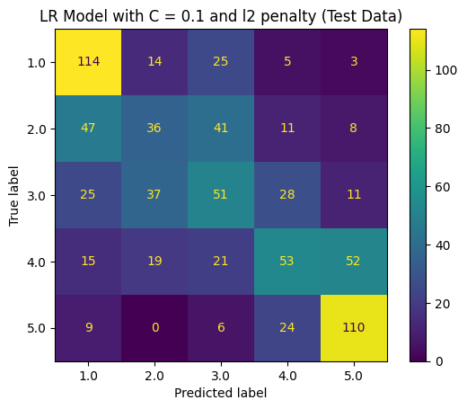
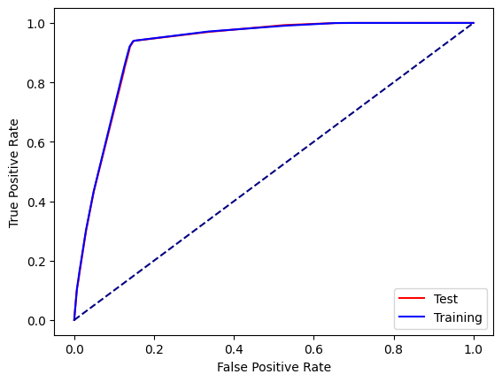

# Data Scientist

## Education
- Post-Bacc Certificate, Data Science - University of Maryland, Baltimore County (_May 2024_) 
- B.S., Bioengineering, Cum Laude - University of Maryland, College Park (_May 2022_)

## Projects
### [Project 1: Yelp Sentiment Analysis and Classification](https://github.com/cwdwiggins/Yelp_Sentiment_Analysis_Project)
- Used an Apple App Store API to scrape 20,000 reviews about Yelp and save it to the disk
- Conducted extensive preprocessing and exploratory data analysis (EDA), identifying language patterns and insights into extreme and neutral sentiments
- Used the gensim package to train a neural network on the Yelp corpus and utilized the resulting word embeddings to enhance classification model performance
- Built and multiple machine learning models and controlled overfitting using regularization, yielding model accuracies of 92% for binary classfication and 48% for multiclass classifcation
    

### [Project 2: Classification Model to Predict and Employee's Resignation with Python](https://github.com/cwdwiggins/DS602/blob/main/midterm/DATA_602_Midterm_Notebook.ipynb)
- Performed exploratory data analysis to uncover factors contributing to an employee's resignation using Python and data visualization packages such as Matplotlib and Seaborn
- Developed a pre-processing data pipeline to clean and prepare numerical and categorical features for modeling
- Compared performance of logistic regression, decision tree, and random forest models based on their F1-score for predicting an employee’s resignation and used cross-validation to identify optimal hyperparameters
- Selected a final model and evaluated its performance on training and testing data by creating a confusion matrix and a Reciever Operating Characteristic (ROC) curve

### [Project 3: Flight Price Prediction Using Regression in R](https://cwdwiggins.github.io/Flight-Price-Project/)
- Obtained a dataset from Kaggle.com that contained information on flight details and fares in India
- Performed exploratory data analysis to analyze and derive features for modeling and identified four features for use in the model
- Built linear regression, random forest regression, and decision tree regression models and manually calculated their R-squared values for performance comparison
- Experimented with explanatory variable interactions and how they affected model performance
- Selected a best performing model and created diagnostic plots for easier understanding of the model's effectiveness   

