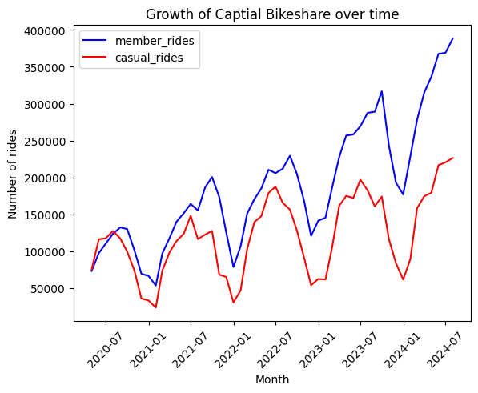
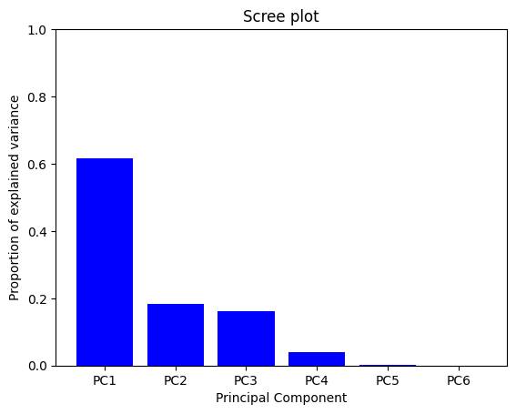

# Data Scientist

## Education
- Post-Bacc Certificate, Data Science - University of Maryland, Baltimore County (_May 2024_) 
- B.S., Bioengineering, Cum Laude - University of Maryland, College Park (_May 2022_)

## Projects
### [Project 1: Yelp Sentiment Analysis with NLP in Python](https://github.com/cwdwiggins/Yelp_Sentiment_Analysis_Project)
- Used an Apple App Store API to scrape 20,000 reviews about Yelp and save it to the disk
- Conducted extensive preprocessing and exploratory data analysis (EDA), identifying language patterns and insights into extreme and neutral sentiments
- Used the gensim package to train a neural network on the Yelp corpus and utilized the resulting word embeddings to enhance classification model performance
- Built and multiple machine learning models and controlled overfitting using regularization, yielding model accuracies of 92% for binary classfication and 48% for multiclass classifcation     
   
Figure 1. Confusion matrix displaying model accuracy when classifying each review as one of five categories (one-star reviews through five-star reviews).

### [Project 2: Capital Bikeshare Demand Forecasting with SQL and Principal Component Analysis](https://github.com/cwdwiggins/Capital_Bikeshare_Project)
- Queried and joined ride activity and weather data using a SQL API, generating visualizations in Python and Tableau to analyze demand trends
- Applied Principal Component Analysis (PCA) to reduce collinearity and improve model performance
- Developed and optimized a Random Forest Regression Model, achieving an R2 score of 81%, demonstrating its potential for improving Capital Bikeshare’s resource planning and operational efficiency   
   
Figure 2. Trend analysis of Capital Bikeshare demand from 2020 to 2024.
   
Figure 3. Scree plot showing validity of dimensionality reduction by plotting the proportion of explained variance for each principal component, showing that nearly 95% of changes in demand are attributed to the first three principal components.   

### [Project 3: Classification Model to Predict and Employee's Resignation with Python](https://github.com/cwdwiggins/DS602/blob/main/midterm/DATA_602_Midterm_Notebook.ipynb)
- Performed exploratory data analysis to uncover factors contributing to an employee's resignation using Python and data visualization packages such as Matplotlib and Seaborn
- Developed a pre-processing data pipeline to clean and prepare numerical and categorical features for modeling
- Compared performance of logistic regression, decision tree, and random forest models based on their F1-score for predicting an employee’s resignation and used cross-validation to identify optimal hyperparameters
- Selected a final model and evaluated its performance on training and testing data by creating a confusion matrix and a Reciever Operating Characteristic (ROC) curve - yielding an area under the curve (AUC) of 92%      
   
Figure 4. Reciever Operating Characteristic (ROC) curve plotting the model's true positive rate against the false positive rate for increasing model sensitivity, showing that less sensitive versions of the model maintain a high level of accuracy on both training and testing data. 

### [Project 4: Flight Price Prediction Using Regression in R](https://cwdwiggins.github.io/Flight-Price-Project/)
- Obtained a dataset from Kaggle.com that contained information on flight details and fares in India
- Performed exploratory data analysis to analyze and derive features for modeling and identified four features for use in the model
- Built linear regression, random forest regression, and decision tree regression models and manually calculated their R-squared values for performance comparison
- Experimented with explanatory variable interactions and how they affected model performance
- Selected a best performing model and created diagnostic plots for easier understanding of the model's effectiveness   

   
Figure 5. Side-by-side boxplots showing variation in flight fare according to the route and airlines taken, as well as a decision tree regressor that details how flight fare estimates are made.   

