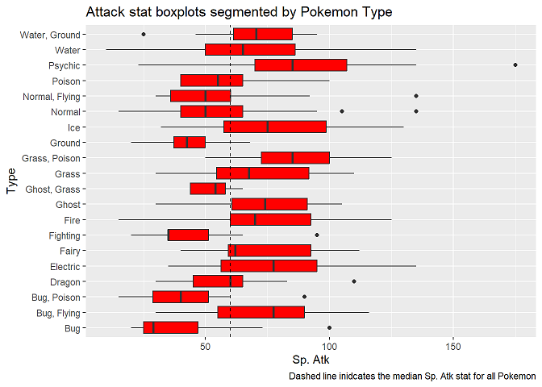

# Aspiring Data Scientist

## Education
- Post-Bacc Certificate, Data Science - University of Maryland, Baltimore County (_May 2024_) 
- B.S., Bioengineering, Cum Laude - University of Maryland, College Park (_May 2022_)

## Projects
### [Project 1: Flight Price Prediction Using Regression in R](https://cwdwiggins.github.io/Flight-Price-Project/)
- Obtained a dataset from Kaggle.com that contained information on flight details and fares in India
- Performed exploratory data analysis to analyze and derive features for modeling and identified four features for use in the model
- Built linear regression, random forest regression, and decision tree regression models and manually calculated their R-squared values for performance comparison
- Experimented with explanatory variable interactions and how they affected model performance
- Selected a best performing model and created diagnostic plots for easier understanding of the model's effectiveness   

### [Project 2: Pokemon Type Classification Using Pokemon Stats in R](https://cwdwiggins.github.io/Pokemon-Stats-Project/)
- Used a Kaggle.com dataset that contained information on Pokemon six Pokemon stats to predict the type of Pokemon based off two stats only
- Determined two candidate stats and build Decision Tree, k-Nearest Neighbors, and Random Forest models for comparison
- Created more granular labels based off initial modeling results to attempt a higher model accuracy
- Re-built the models, analyzed performance, and identified next steps for greater improvement

