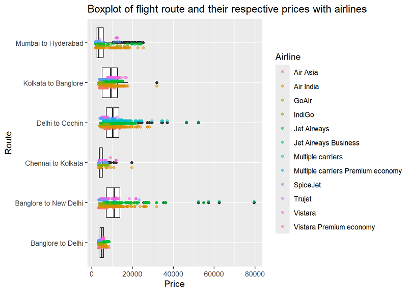
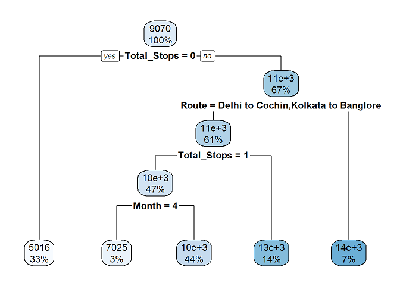

# Aspiring Data Scientist

## Education
Post-Bacc Data Science Certificate from University of Maryland, Baltimore County (May 2024) 
B.S. Bioengineering w/ Cum Laude honors from University of Maryland, College Park (May 2022)

## Projects
### [Project 1: Flight Price Prediction Using Regression in R](https://cwdwiggins.github.io/Flight-Price-Project/)
- Obtained a dataset from Kaggle.com that contained information on flight details and fares in India
- Performed exploratory data analysis to analyze and derive features for modeling and identified four features for use in the model
- Built linear regression, random forest regression, and decision tree regression models and manually calculated their R-squared values for performance comparison
- Experimented with explanatory variable interactions and how they affected model performance
- Selected a best performing model and created diagnostic plots for easier understanding of the model's effectiveness   

### Project 2: Pokemon Type Classification Using Pokemon Stats in R

